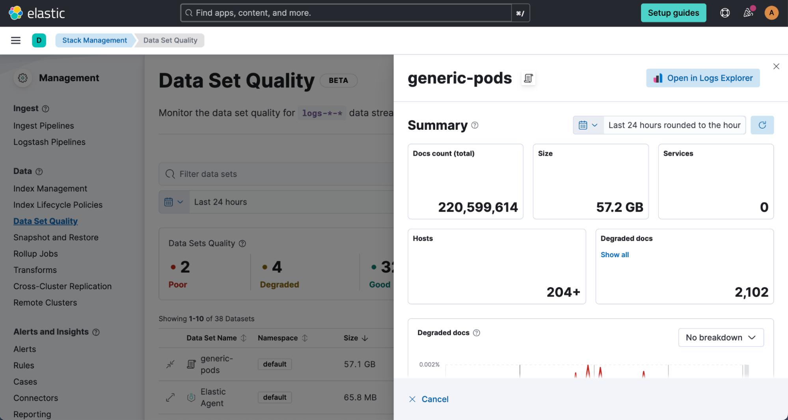
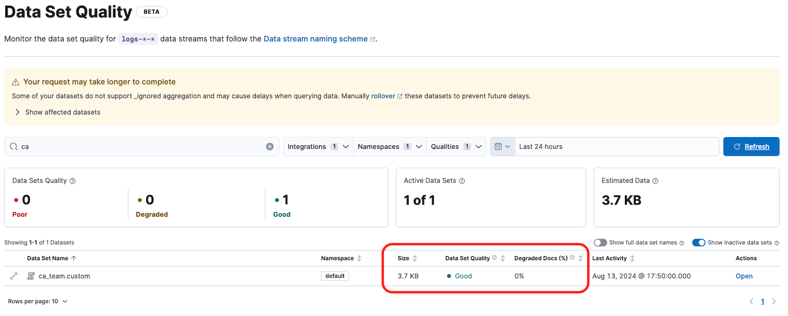
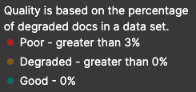
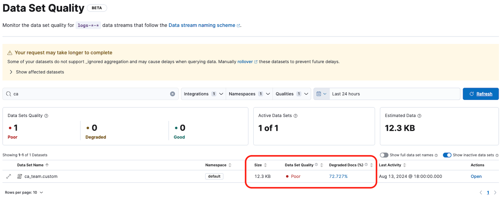
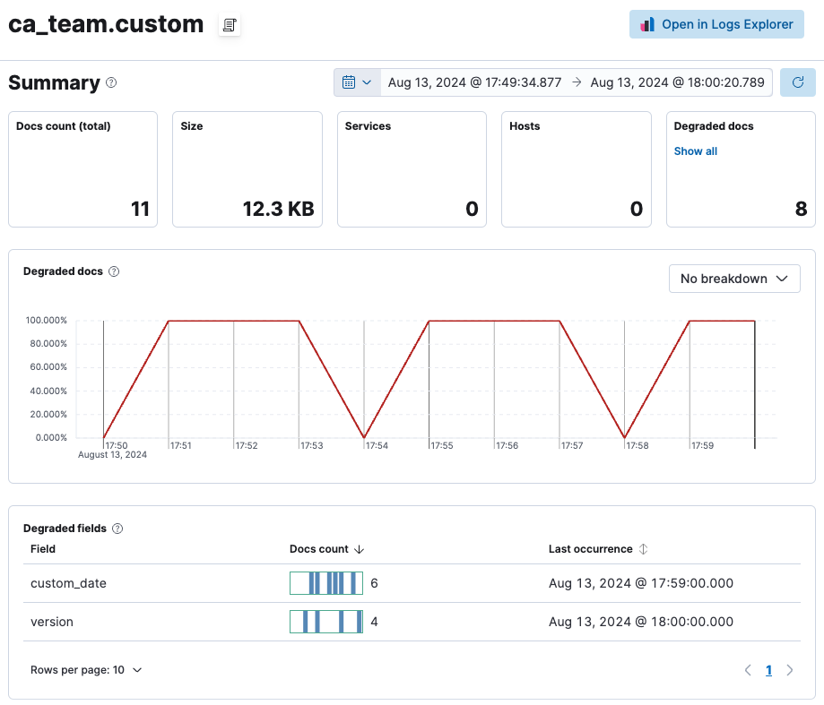

# Elastic O11y - Data Quality ✅

This repository is a simple PoC about how Data Quality works to show the Data Streams data analyzis.

Why I wrote about that? Because any log have his value until his owner decide the opposit! And before this decision we need to index it, but we know that are some challenges, like a field does not match in data type or structure and because of this the whole document is dropped.

### About Data Quality

This is a new Elastic feature released at [8.15 version](https://www.elastic.co/blog/whats-new-elastic-observability-8-15-0).

> The beta release of our new data set quality feature in Elastic Observability allows users to identify and isolate any issues related to logs data quality, which could occur during ingestion, parsing, and field mapping. By providing an overview of all data sets with estimated size, ingested documents, and quality information based on degraded documents, users can view quality trends over time; identify responsible integrations, fields, and data types; and drill down into specific issues. The document viewer also highlights any problems with log ingestion and parsing, ensuring data completeness for each individual log message. Upgrade your cluster to the latest version to try this new experience yourself



### PoC

The first step in this PoC is to create a Data Stream. The first time, you need to create a template that will automate the process of creating mappings, settings, etc. Pay close attention to the **mappings** because the **data_stream** is mandatory for viewing our data in the Data Quality Dashboard.

```json
PUT _index_template/logs-ca_team.custom-default 
{
  "priority": 500,
  "template": {
    "mappings": {
      "properties": {
        "@timestamp": {
          "type": "date",
          "ignore_malformed": false
        },
        "data_stream": {
          "properties": {
            "dataset": { // THIS FIELD IS MANDATORY
              "type": "keyword" 
            },
            "namespace": { // THIS FIELD IS MANDATORY
              "type": "keyword"
            },
            "type": { // THIS FIELD IS MANDATORY
              "type": "keyword"
            }
          }
        },
        "version": {
          "type": "keyword",
          "ignore_above": 5 // THIS CONFIGURATION WILL IGNORE VALUES GREATER THAN 5 CARACTERES
        },
        "custom_date": {
          "type": "date", 
          "ignore_malformed": true // THIS CONFIGURATION WILL ACCEPT DATES WITH WRONG FORMAT
        }
      }
    },
    "settings": {
    }
  },
  "index_patterns": [
    "logs-ca_team.custom-default"
  ],
  "data_stream": {
    "hidden": false,
    "allow_custom_routing": false
  },
  "composed_of": []
}
```

After to create your mapping you can add your first document in your Data Stream.

```json
POST logs-ca_team.custom-default/_doc
{
  "version": "1",
  "@timestamp": "2024-08-13T20:50:00.000Z", //Adjust this to your current date
  "data_stream": {
    "namespace": "default",
    "type": "logs",
    "dataset": "ca_team.custom"
  }
}
```

If you go to Stack Management -> Data Set Quality you will be able to see the first analysis about your Data Stream.



So, this Data Stream size is **3.7 KB**, have a **GOOD** Data Quality and **0%** of Degraded Docs. NICE!

How is this calculated? So simple, using the following information:



### *Let's Change this quality!!* 

Now we will add some documents with problematic fields, for example, **version** and **custom_date**. (*Obs. Ajust the date values to your current date*)

```json
POST _bulk
{ "create" : { "_index" : "logs-ca_team.custom-default" } }
{"version":"Lets try to degrated this dataset","@timestamp":"2024-08-13T20:51:00.000Z","data_stream":{"namespace":"default","type":"logs","dataset":"ca_team.custom"}}
{ "create" : { "_index" : "logs-ca_team.custom-default" } }
{"version":"1","@timestamp":"2024-08-13T20:52:00.000Z","data_stream":{"namespace":"default","type":"logs","dataset":"ca_team.custom"},"custom_date": "2024-08-13 20:52:00"}
{ "create" : { "_index" : "logs-ca_team.custom-default" } }
{"version":"Lets try to degrated this dataset","@timestamp":"2024-08-13T20:53:00.000Z","data_stream":{"namespace":"default","type":"logs","dataset":"ca_team.custom"},"custom_date": "2024-08-13 20:53:00"}
{ "create" : { "_index" : "logs-ca_team.custom-default" } }
{"version":"1","@timestamp":"2024-08-13T20:54:00.000Z","data_stream":{"namespace":"default","type":"logs","dataset":"ca_team.custom"}}
{ "create" : { "_index" : "logs-ca_team.custom-default" } }
{"version":"1","@timestamp":"2024-08-13T20:55:00.000Z","data_stream":{"namespace":"default","type":"logs","dataset":"ca_team.custom"},"custom_date": "2024-08-13 20:55:00"}
{ "create" : { "_index" : "logs-ca_team.custom-default" } }
{"version":"1","@timestamp":"2024-08-13T20:56:00.000Z","data_stream":{"namespace":"default","type":"logs","dataset":"ca_team.custom"},"custom_date": "2024-08-13 20:56:00"}
{ "create" : { "_index" : "logs-ca_team.custom-default" } }
{"version":"Lets try to degrated this dataset","@timestamp":"2024-08-13T20:57:00.000Z","data_stream":{"namespace":"default","type":"logs","dataset":"ca_team.custom"},"custom_date": "2024-08-13 20:57:00"}
{ "create" : { "_index" : "logs-ca_team.custom-default" } }
{"version":"1","@timestamp":"2024-08-13T20:58:00.000Z","data_stream":{"namespace":"default","type":"logs","dataset":"ca_team.custom"}}
{ "create" : { "_index" : "logs-ca_team.custom-default" } }
{"version":"1","@timestamp":"2024-08-13T20:59:00.000Z","data_stream":{"namespace":"default","type":"logs","dataset":"ca_team.custom"},"custom_date": "2024-08-13 20:59:00"}
{ "create" : { "_index" : "logs-ca_team.custom-default" } }
{"version":"Lets try to degrated this dataset","@timestamp":"2024-08-13T21:00:00.000Z","data_stream":{"namespace":"default","type":"logs","dataset":"ca_team.custom"}}
```

Now we have the following scenario, this Data Stream size is **12.3 KB**, have a **POOR** Data Quality and **72.724%** of Degraded Docs!



Interesting, but is there any way to see **when**, **who** and **how many**? Yes, there is! If you click in the extend icon you will be able to see more details about this Data Stream.



# Great Job!


